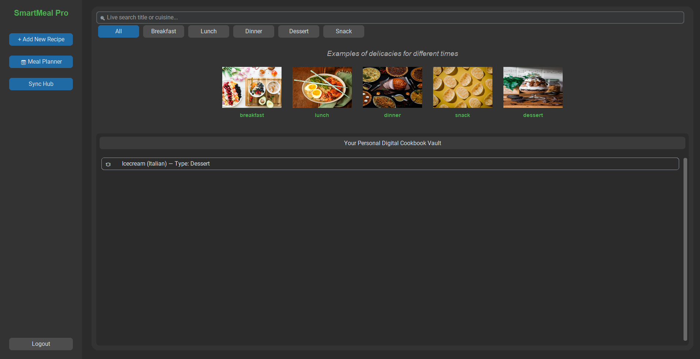

 # SmartMeal Pro - Recipe & Meal Planning Manager

SmartMeal Pro is a modern desktop application built using Python and CustomTkinter. It allows users to manage their personal digital cookbook vault, plan meals dynamically using an interactive calendar, and automatically compile smart shopping lists based on scheduled menus. Backed by MongoDB, it ensures persistent storage and fast data retrieval.

---

## Features

* **Secure Authentication:** User account creation and secure login dashboard interfaces.
* **Persistent Delicacies Gallery:** A fixed visual inspiration grid displaying sample items for Breakfast, Lunch, Dinner, Snack, and Dessert.
* **Dynamic Cookbook Vault:** Live search capability filtering your personal collection by title or cuisine, with interactive buttons to view, edit, or delete entries.
* **Smart Meal Planner:** An interactive calendar scheduler that prevents backdated planning by blocking days that have already passed.
* **Automated Shopping List Generator:** Compiles a clean checklist of required ingredients based on the active scheduled meals for any selected date.

---

## Tech Stack

* **GUI Framework:** CustomTkinter (Dark Mode Optimized)
* **Database Engine:** MongoDB (via PyMongo)
* **Calendar Engine:** tkcalendar
* **Image Processing:** Pillow (PIL)

---

## Installation & Setup

Follow these steps to set up and run the application locally on your machine.

### 1. Clone or Open the Project
(https://github.com/Natasha-tech-art/recipe-manager.git)

### 2.Set up a virtual environment
python -m venv my_env
my_env\Scripts\activate

### 3.Install required dependencies
pip install customtkinter pymongo tkcalendar Pillow

### 4.Ensure mongodb is running

## A Screenshot of the dashboard

## Project by
   NATASHA BOLYN

